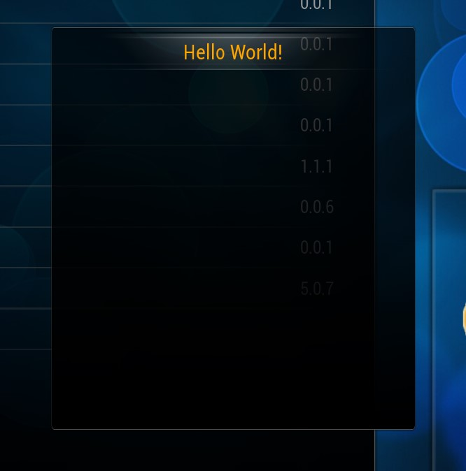
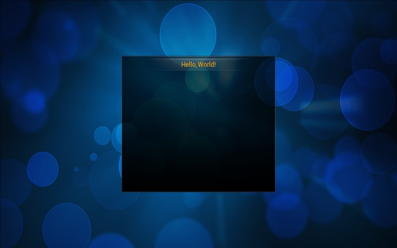

Base Classes
============

PyXBMCt provides 4 base classes: `AddonDialogWindow`_, `AddonFullWindow`_, `BlankDialogWindow and BlankFullWindow`_. These classes serve as containers for other UI elements (controls).
All base classes are "new-style" Python classes.

AddonDialogWindow
-----------------

``AddonDialogWindow`` class is based on ``xbmcgui.WindowDialog`` and provides an interface window with
background and a title-bar.
The window serves as a parent control to other UI controls. Like all the other base classes,
AddonDialogWindow has the Grid layout manager to simplify arranging your UI controls and the event connection manager
to connect XBMC UI events to functions and methods of your addon.

    **AddonDialogWindow parent window**

The main control window of ``AddonDialogWindow`` is always displayed on top of Kodi UI, even video playback and music
visualization, so it’s better suited for addons that are not supposed to play video or music.
Note that width, height and coordinates (optional) for the control window are specified in Kodi UI coordinate grid pixels.
The default resolution of UI coordinate grid is always 1280x720 regardless of your actual display resolution.
This way UI elements have the same visible size no matter what display resolution you use.
If no explicit coordinates are provided, the control window is placed at the center of the screen.

AddonFullWindow
---------------

``AddonFullWinow`` is based on ``xbcmgui.Window`` class. It is similar to ``AddonDialogWindow``
and also provides a parent control window for other UI controls. But, unlike ``AddonDialogWindow``,
it has a solid main background (for which the default Confluence background is used)
and can hide under video or music visualization.

    **AddonFullWindow parent control window**

BlankDialogWindow and BlankFullWindow
-------------------------------------

``BlankDialogWindow`` and ``BlankFullWindow`` are based on ``xbmcgui.WindowDialog`` and ``xbmcgui.Window`` respectively.
They have no visual elements whatsoever, but, like the 2 previously described classes,
they provide the Grid layout and event connection managers.

Those classes are meant for DIY developers who want full control over the visual appearance of their addons.

API Reference
-------------

.. autosummary::

    pyxbmct.addonwindow.AddonDialogWindow
    pyxbmct.addonwindow.AddonFullWindow
    pyxbmct.addonwindow.BlankDialogWindow
    pyxbmct.addonwindow.BlankFullWindow
